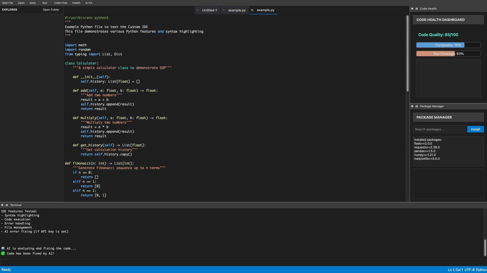
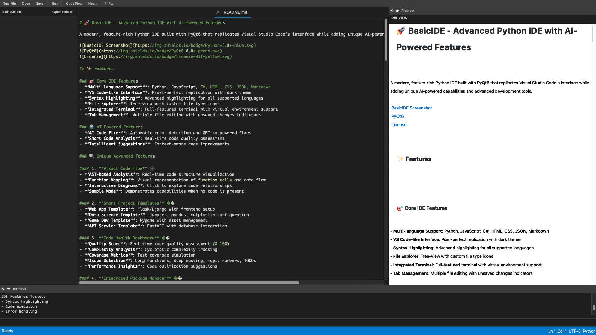

# 🚀 BasicIDE - Advanced Python IDE with AI-Powered Features

A modern, feature-rich Python IDE built with PyQt6 that replicates Visual Studio Code's interface while adding unique AI-powered capabilities and advanced development tools.


## 📸 Screenshots

### Python Development

*VS Code-like interface with Python syntax highlighting, integrated terminal, and advanced features*

### Web Development

*Multi-language support with HTML/CSS editing and live preview capabilities*

## 🚀 Quick Demo

**See BasicIDE in action!** The screenshots above showcase:

- **🎯 Python Development**: Syntax highlighting, integrated terminal, and AI-powered features
- **🌐 Web Development**: HTML/CSS editing with live preview and multi-language support
- **🕸️ Visual Code Flow**: Real-time code structure analysis and visualization
- **📊 Health Dashboard**: Code quality metrics and optimization suggestions
- **🤖 AI Code Fixing**: Automatic error detection and correction

## ✨ Features

### 🎯 Core IDE Features
- **Multi-language Support**: Python, JavaScript, C#, HTML, CSS, JSON, Markdown
- **VS Code-like Interface**: Pixel-perfect replication with dark theme
- **Syntax Highlighting**: Advanced highlighting for all supported languages
- **File Explorer**: Tree-view with custom file type icons
- **Integrated Terminal**: Full-featured terminal with virtual environment support
- **Tab Management**: Multiple file editing with unsaved changes indicators

### 🏆 What Makes BasicIDE Special
- **🎨 Visual Code Flow**: Unique AST-based code visualization (shown in screenshots)
- **🤖 AI-Powered Fixing**: GPT-4o integration for automatic error correction
- **📊 Real-time Health Metrics**: Code quality analysis and optimization suggestions
- **📦 Smart Project Templates**: Pre-configured project scaffolding
- **🔧 Integrated Package Management**: Visual dependency management

### 🤖 AI-Powered Features
- **AI Code Fixer**: Automatic error detection and GPT-4o powered fixes
- **Smart Code Analysis**: Real-time code quality assessment
- **Intelligent Suggestions**: Context-aware code improvements

### 🔍 Unique Advanced Features

#### 1. **Visual Code Flow** 🕸️
- **AST-based Analysis**: Real-time code structure visualization
- **Function Mapping**: Visual representation of function calls and data flow
- **Interactive Diagrams**: Click to explore code relationships
- **Sample Mode**: Demonstrates capabilities when no code is present

#### 2. **Smart Project Templates** 📋
- **Web App Template**: Flask/Django with frontend setup
- **Data Science Template**: Jupyter, pandas, matplotlib configuration
- **Game Dev Template**: Pygame with asset management
- **API Service Template**: FastAPI with database integration

#### 3. **Code Health Dashboard** 📊
- **Quality Score**: Real-time code quality assessment (0-100)
- **Complexity Analysis**: Cyclomatic complexity tracking
- **Coverage Metrics**: Test coverage simulation
- **Issue Detection**: Long functions, deep nesting, magic numbers, TODOs
- **Performance Insights**: Code optimization suggestions

#### 4. **Integrated Package Manager** 📦
- **Search & Install**: Browse and install Python packages
- **Dependency Graph**: Visual representation of package relationships
- **Conflict Detection**: Automatic dependency conflict resolution
- **Virtual Environment Integration**: Seamless venv management

### 🛠️ Development Tools
- **Virtual Environment Management**: Create, activate, and manage Python environments
- **Markdown/HTML Preview**: Live preview with syntax highlighting
- **Code Execution**: Run code directly from the editor
- **Error Handling**: Comprehensive error reporting and debugging

## 🚀 Quick Start

### Prerequisites
- Python 3.8 or higher
- PyQt6
- OpenAI API key (for AI features)

### Installation

1. **Clone the repository**
```bash
git clone https://github.com/WillZLog/BasicIDE.git
cd BasicIDE
```

2. **Install dependencies**
```bash
pip install -r requirements.txt
```

3. **Set up OpenAI API key** (optional, for AI features)
```bash
export OPENAI_API_KEY="your-api-key-here"
```

4. **Run the IDE**
```bash
python3 ide.py
```

## 📖 Usage Guide

### 🎯 Getting Started

1. **Launch BasicIDE**
   - Run `python3 ide.py`
   - The IDE opens with a VS Code-like interface

2. **Open a Project**
   - Click "File" → "Open Folder" or use the sidebar
   - Navigate to your project directory

3. **Create New Files**
   - Use "File" → "New File" or Ctrl+N
   - Files are automatically detected by extension

### 🤖 Using AI Features

#### AI Code Fixer
1. **Write code with errors** in the editor
2. **Run the code** (F5 or "Run" button)
3. **Click "Ask AI"** when errors appear
4. **Review and apply** the AI-suggested fixes

#### Visual Code Flow
1. **Open a Python file** with functions and variables
2. **Click "Code Flow"** in the toolbar
3. **Explore the visual diagram** showing code structure
4. **Analyze relationships** between functions and variables

#### Code Health Dashboard
1. **Click "Health"** in the toolbar
2. **View quality metrics** and suggestions
3. **Address issues** highlighted by the dashboard

### 🛠️ Advanced Features

#### Virtual Environment Management
```bash
# Create new environment
Project → Create Virtual Environment

# Activate environment
Project → Activate Virtual Environment

# Install packages
Project → Install Package
```

#### Project Templates
1. **Project** → **New Project from Template**
2. **Choose template type**:
   - Web App (Flask/Django)
   - Data Science (Jupyter/pandas)
   - Game Development (Pygame)
   - API Service (FastAPI)
3. **Select project location**
4. **Customize settings**

#### Package Management
1. **Open Package Manager** (Project menu)
2. **Search for packages** using the search bar
3. **View dependency graph** for conflict detection
4. **Install packages** with one click

## 🎨 Customization

### Themes
- **Dark Theme**: Default VS Code-like appearance
- **Customizable**: Modify colors in `theme_manager.py`

### Keybindings
- **Standard VS Code shortcuts**: Ctrl+S, Ctrl+N, F5, etc.
- **Custom shortcuts**: Configurable in the menu system

### Extensions
- **Modular architecture**: Easy to add new features
- **Plugin system**: Extend functionality with custom modules

## 🏗️ Project Structure

```
BasicIDE/
├── ide.py                   # Main application entry point
├── ai_fix.py               # AI-powered code fixing
├── requirements.txt        # Python dependencies
├── README.md              # This file
├── .gitignore             # Git ignore rules
├── LICENSE                # MIT License
├── example.py             # Sample Python file
├── example.html           # Sample HTML file
└── docs/                  # Documentation
    ├── screenshots/       # IDE screenshots
    └── features/          # Feature documentation
```

## 🔧 Configuration

### Environment Variables
- `OPENAI_API_KEY`: Required for AI features
- `PYTHONPATH`: Custom Python interpreter path

### Settings
- **Editor**: Font, theme, tab size
- **Terminal**: Shell preferences
- **AI**: Model selection, temperature

## 🤝 Contributing

We welcome contributions! Please see our [Contributing Guidelines](CONTRIBUTING.md) for details.

### Development Setup
1. **Fork the repository**
2. **Create a feature branch**
3. **Make your changes**
4. **Add tests** (if applicable)
5. **Submit a pull request**

### Code Style
- **PEP 8**: Python code style guidelines
- **Type hints**: Use type annotations
- **Docstrings**: Document all functions and classes

## 🐛 Troubleshooting

### Common Issues

#### "Python command not found"
```bash
# Use python3 instead
python3 ide.py
```

#### "PyQt6 not found"
```bash
# Install PyQt6
pip install PyQt6
```

#### "OpenAI API Error"
- Check your API key is set correctly
- Verify your OpenAI account has credits
- Ensure the API key has proper permissions

#### "Icons not showing"
- Icons are text-based for compatibility
- Check font support for special characters

### Performance Issues
- **Large files**: Consider splitting into smaller modules
- **Memory usage**: Close unused tabs
- **Startup time**: First launch may be slower

## 📄 License

This project is licensed under the MIT License - see the [LICENSE](LICENSE) file for details.

## 🙏 Acknowledgments

- **Visual Studio Code**: Interface inspiration
- **PyQt6**: GUI framework
- **OpenAI**: AI capabilities
- **Python Community**: Libraries and tools

## 📞 Support

- **Issues**: [GitHub Issues](https://github.com/WillZLog/BasicIDE/issues)
- **Discussions**: [GitHub Discussions](https://github.com/WillZLog/BasicIDE/discussions)
- **Email**: williamalbinze@gmail.com
## 🚀 Roadmap

### Upcoming Features
- [ ] **Git Integration**: Built-in version control
- [ ] **Debugger**: Advanced debugging capabilities
- [ ] **Extensions**: Plugin system
- [ ] **Cloud Sync**: Settings and preferences sync
- [ ] **Collaboration**: Real-time collaborative editing

### Version History
- **v1.0.0**: Initial release with core features
- **v1.1.0**: Added AI-powered code fixing
- **v1.2.0**: Visual Code Flow and Health Dashboard
- **v1.3.0**: Project Templates and Package Manager

---

**Made with ❤️ by WillZLog**

*Transform your coding experience with AI-powered development tools!* 